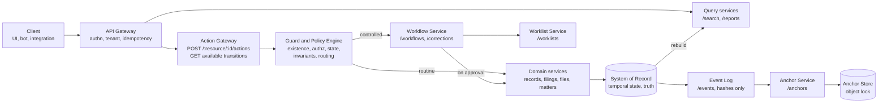
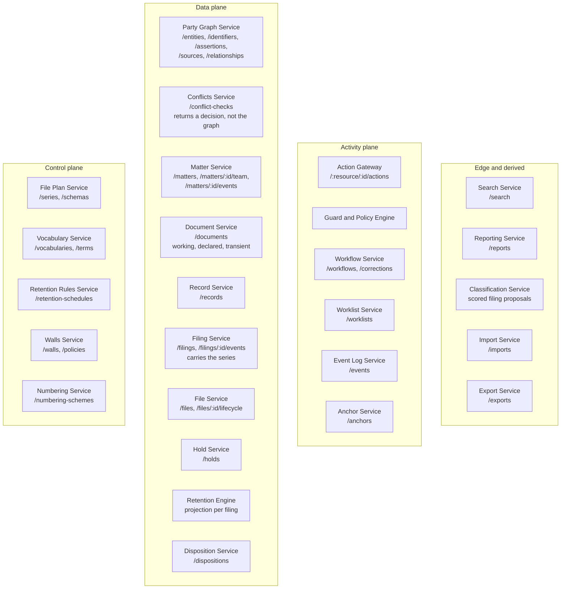
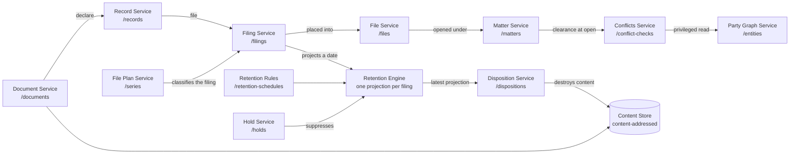
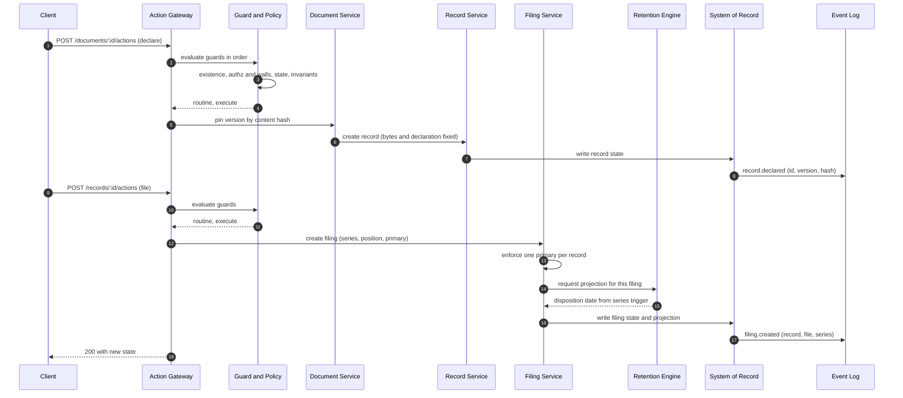
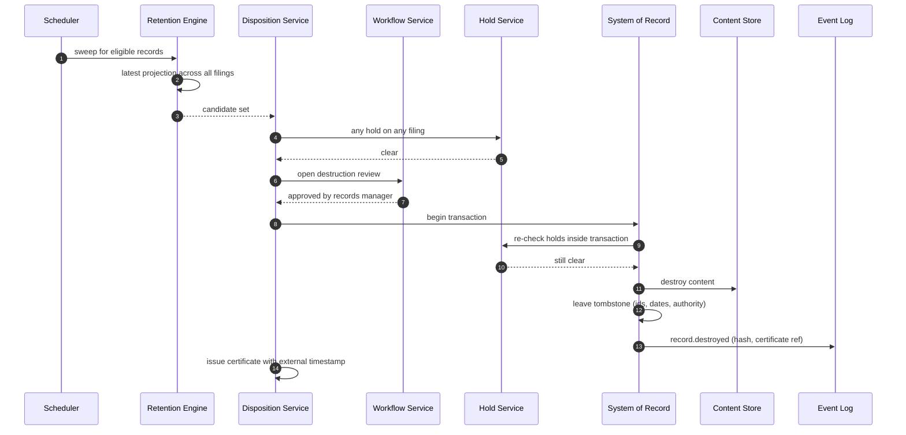
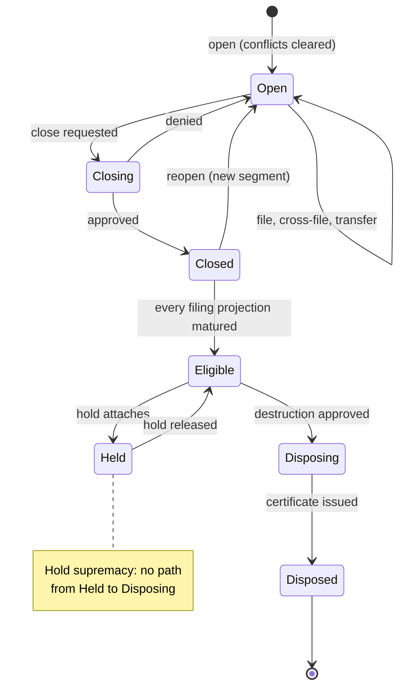
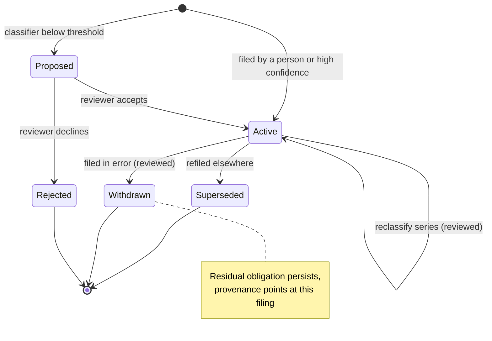

# Service and endpoint map

Headless legal records and matter management platform. Companion to the platform overview, revision C.

Path parameters are written `:id` rather than `{id}` because braces are unreliable inside Mermaid node labels. The API contract uses `{id}`.

Service boundaries below are a decomposition proposal, not a settled deployment topology. Several of these could reasonably collapse into one service (record, filing, and file are a strong candidate for a single records service, since they share invariants and transactions). Split them at the seams where team ownership and scaling actually differ, not because the diagram drew a box.

---

## 1. Request path

How any call moves through the platform. Every transition on every resource passes through one action endpoint and one guard chain, which is what makes the invariants centrally enforceable.

---

## 2. Service inventory by plane

The full decomposition with the endpoints each service owns. Dependencies are drawn in diagrams 1 and 3 rather than here, so this stays readable as a reference.

---

## 3. Domain dependencies

The write side of the data plane, showing where the series attaches and how an obligation reaches disposition.

---

## 4. Declare and file a document

The write path. Note that the series is applied by the filing, and that the event carries a hash rather than content.

---

## 5. Disposition run

The read-check-destroy path. The hold re-check inside the destroying transaction is the load-bearing step.

---

## 6. File lifecycle

Segments rather than rewind. Reopening opens a new segment and suspends the retention clock.

---

## 7. Filing lifecycle

Filings are never deleted. Withdrawal leaves a residual obligation so the ratchet survives.

---

## Notes on the decomposition

**The Conflicts Service returns a decision, not the graph.** This is the shape that answers the open question about party graph readability. If callers can query `/entities` freely, the platform leaks who the firm represents against whom. Routing conflicts through a privileged service keeps the graph closed while still answering the question that matters at matter open.

**The Action Gateway is a chokepoint, deliberately.** Every transition on every resource passes through it, which is what makes the guard order and the invariants centrally enforceable. It is also a single point of catastrophic failure, so it needs its own change control, staged policy promotion, and dry-run against historical actions before any rule touching disposition goes live.

**The Retention Engine is a service, not a library.** Projections recompute when any trigger fires anywhere, including on files the caller was not touching. Embedding that logic in each domain service guarantees it drifts.

**Record, filing, and file could be one service.** They share transactions and invariants, and the primary-filing uniqueness constraint and the hold re-check both want to be transactional. Splitting them means distributed transactions or sagas for operations that are conceptually atomic. My recommendation is one records service with three resource families until scale forces otherwise.

**The Event Log is downstream of the system of record, never upstream.** Nothing reads from the log to serve a request. Search and reporting rebuild from the system of record, so a destroyed record cannot reappear in an index.
